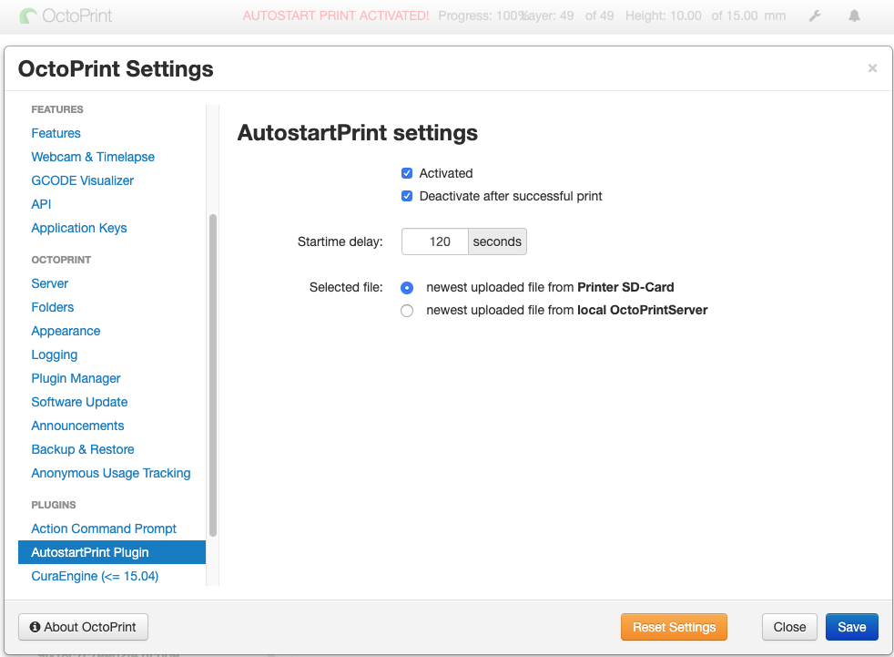
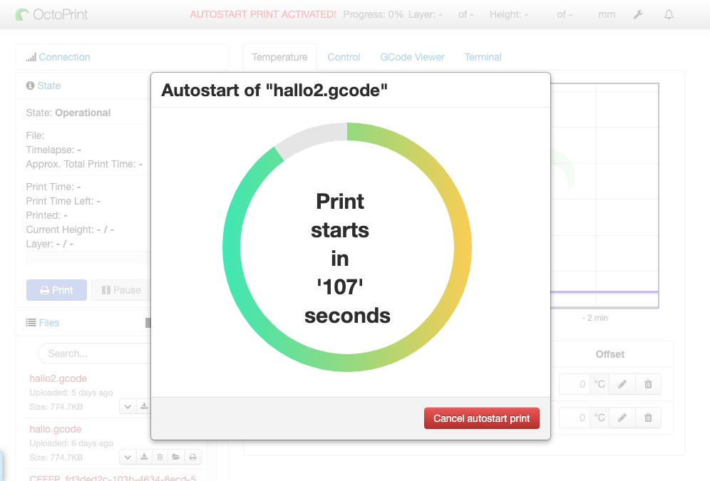

# OctoPrint-AutostartPrint

Plugin starts a print job after the Printer is connected (e.g. after powering up). It selects the lasted uploaded file for print.

If you want to start a printjob after powering up your OctoPrintServer, make sure you do the folowing steps:

1. Make sure you check "Auto-connect on server startup" in NavigationBar
2. Select what kind of file do you want to print from "local-" or "sd-card-filesystem" in the Plugin-Settings
3. Define a delay in seconds
3. Activate the Plugin 

--> Next time the printer is connected a countdown is started and after that countdown the print starts automatically. 

## Screenshots

## Setup

Install via the bundled [Plugin Manager](https://github.com/foosel/OctoPrint/wiki/Plugin:-Plugin-Manager)
or manually using this URL:

    https://github.com/OllisGit/OctoPrint-AutostartPrint/releases/latest/download/master.zip

## Versions

see [Release-Overview](https://github.com/OllisGit/OctoPrint-AutostartPrint/releases/)

## Roadmap
* Preselection of a file, instead of latest file from SD/Local-Filesystem
